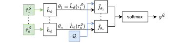

# Adversarially Robust Few-Shot Image Classification: Exploring Implicit Model Uncertainty via Task Embeddings
*The dual problem of few-shot learning in an adversarial setting is relevant but very challenging. We investigate the potential of introducing uncertainty on the parameters of the adapted model, trying to improve both natural and adversarial accuracy. To this extent, we introduce noise within the task embedding space of a hypernetwork that parameterizes our classifier. We demonstrate that adversarial robustness can be improved if the attacker is oblivious to the sampled noise. A comparison with state-of-the-art methods reveals that our approach needs further refinements to be competitive.*



*Architecture of n-way classifier: Depicts the forward path when doing few-shot classification on support set $\mathcal{S}$ and query set $\mathcal{Q}$. $\hat{\tau}_{1}^\mathcal{S} \cdots \hat{\tau}_{n}^\mathcal{S}$ are the adapted task embeddings for each of the n binary one-vs-rest classifiers.*

## Setup
### VC v14+ runtime
The package learn2learn (currently) requires the VCv 14+ runtime library to be installed on your PC. If you install Visual Studio with workload "Desktop development with C++", you will have all the necessary packages installed.

### Conda
```
conda create --name dl python=3.9
conda activate dl

pip install -r requirements.txt
```

## Reproduce the Results
### Ours
#### Training
Note how the following commands are meant for Omniglot but you can change the scenario to miniimagenet. Also you want might want to change the task embedding size (taskembsize).
To train the binary classifiers you can run:
```
python uncertainty.py train-binary-classifiers --scenario omniglot --taskembsize 256 --epochs 500
```
Next you need to compute the embeddings using either mean
```
python uncertainty.py train-meta-embedding --scenario omniglot --method mean --taskembsize 256 --modelfile "uncertainty/models/omniglot/best-binary-classifiers-256.pt"
```
or maml method:
```
python uncertainty.py train-meta-embedding --scenario omniglot --method maml --taskembsize 256 --modelfile "uncertainty/models/omniglot/best-binary-classifiers-256.pt"
```
You can abort training after the number of epochs specified in the report, the models are saved continuously.

#### Evaluations
Requires the models to be trained first!

(not used in report) To see how the binary classifiers perform directly after training you can run:
```
python uncertainty.py val-original --scenario omniglot --taskembsize 256 --modelfile "uncertainty/models/omniglot/best-binary-classifiers-256.pt"
```

To see how good the binary classifiers can be adapted to classes it has seen during training and new classes you can run:
```
python uncertainty.py val-binary-adaptability --scenario omniglot --taskembsize 256 --modelfile "uncertainty/models/omniglot/best-binary-classifiers-256.pt" --metaembfile "uncertainty/models/omniglot/best-meta-embedding-maml-256.pt" --shots 5 --adaptationsteps 5 --lr 0.75
```
In table 1 of the report we used: metaembfile in {"uncertainty/models/omniglot/best-meta-embedding-maml-256.pt", "uncertainty/models/omniglot/best-meta-embedding-mean-256.pt"}, shots in {1, 5}, adaptationsteps in {5, 20}.
Note that you can select the corresponding method (mean vs maml) by the meta-embedding you specify.

(not used in report) To measure how well the one-vs-rest classifiers can work together to build a n-way classifier, run:
```
python uncertainty.py val-fewshot --scenario omniglot --taskembsize 256 --modelfile "uncertainty/models/omniglot/best-binary-classifiers-256.pt" --metaembfile "uncertainty/models/omniglot/best-meta-embedding-maml-256.pt" --ways 5 --shots 5 --adaptationsteps 5 --lr 0.75 --iterations 100
```

To measure the effect of modelling uncertainty on adversarial accuracy and standard accuracy, run: 
```
python uncertainty.py val-defense --scenario omniglot --taskembsize 256 --modelfile "uncertainty/models/omniglot/best-binary-classifiers-256.pt" --metaembfile "models/omniglot/best-meta-embedding-maml-256.pt" --ways 5 --shots 5 --adaptationsteps 5 --lr 0.75 --noise 0.5 --samples 10 --pgdepsilon 0.0314 --pgdstepsize 0.008 --pgdsteps 7 --iterations 250
```
In table 2 of the report we used: noise in {0.1, 0.5, 0.75, 1}, samples in {1, 5, 25}, noisepublic present or not. For no defense, choose noise = 0.0 and samples = 1.0. 
Add the --noisepublic flag to make the noise known to the attacker.

To run the competitive evaluation with different attack strengths etc, run:
```
python evaluate.py --name "uncertainty"
```
This corresponds to tables 3 and 4 in the report.

### Adversarial Querying
#### Training
To train Adversarial Querying using MAML, run:
```
python adversarial_querying/aq.py
```
You can change the dataset `{omniglot, mini-imagenet}` and the number of ways `{1, 5}` in the same file.

#### Evaluations
**AQ (MAML):**  
To evaluate Adversarial Querying run:
```
python evaluate.py --name "AQ"
```

**AQ (MAML) + Noise:**  
To evaluate Adversarial Querying with noise run:
```
python evaluate.py --name "AQ" --add_noise True 
```

### Hypershot
#### Training
Training has been done entirely in Jupyter Notebooks. There are 2 of them:
resnet-hypershot-mini (for mini-image net) and resnet-hypershot-omni (for omniglot).
They can be run as any Jupyter notebook and they will store results in a folder called models at every epoch.

#### Evaluations
Evaluation of the Hypershot models are handled a bit separately due to some specificity of the data format used during training.
In order to run the experiments, you need to run the evaluate.py file inside the hypershot main folder. 
```
python hypershot/evaluate.py
```
If you want to run another model than the ones we ran, you will need to provide the according .pth file in the hypershot_baseline.py file. Also, for the omniglot dataset, you can comment in or out the corresponding line as indicated in the file to run with or without adversarial training.


#### GR 

You can see the latest version of the code for our attempt at reproducing the GR baseline in the gen_baseline folder.

